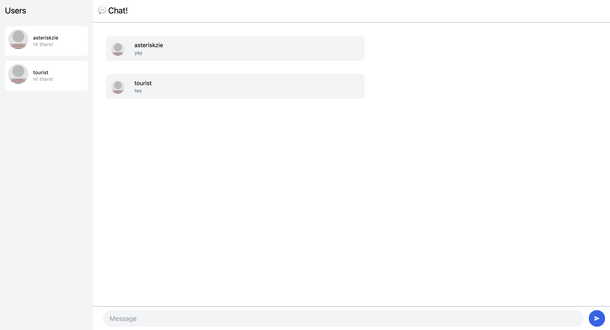
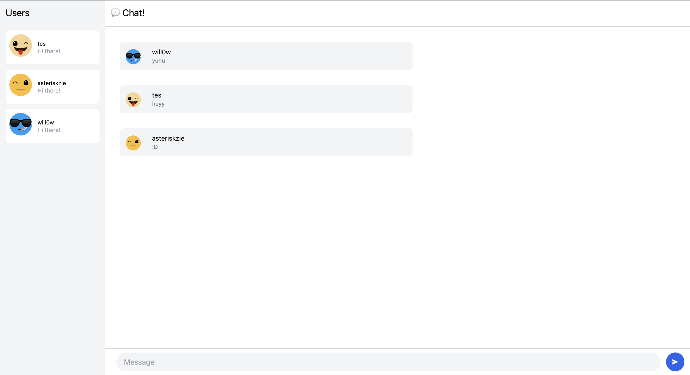

# YewChat - Modified By Ester Gracia (2206041991) 💬
> Source code for [Let’s Build a Websocket Chat Project With Rust and Yew 0.19 🦀](#)

---
## Adpro Reflecion 

Screenshot of YewChat: 


After a touch of creativity: 

Initially the profile picture is broken. Turns out the API endpoints has changed. I read the API documentation and managed to fix it, plus I get to choose the art style I like the most. 

---


## Install

1. Install the required toolchain dependencies:
   ```npm i```

2. Follow the YewChat post!

## Branches

This repository is divided to branches that correspond to the blog post sections:

* main - The starter code.
* routing - The code at the end of the Routing section.
* components-part1 - The code at the end of the Components-Phase 1 section.
* websockets - The code at the end of the Hello Websockets! section.
* components-part2 - The code at the end of the Components-Phase 2 section.
* websockets-part2 - The code at the end of the WebSockets-Phase 2 section.
